# Week 2 Homework Answers

This file contains my answers to the Week 2 homework questions for the 2023 cohort of the Data Engineering Zoomcamp. For convenience, each question is restated before giving the corresponding answer; the list of questions *without* corresponding answers can be found in `01-questions.md`, which can be found in the current directory.

Please note that all of the intructions provided here **assume that your terminal is located in the `02-orchestration/homework` directory**.

## Preparations

Before answering any questions, we need to both prepare our local environment and deploy the cloud resources we'll be interacting with.

### Python Installations

For starters, let's install the Python requirements listed in the `requirements.txt` file found in the current directory:
```bash
pip install -r requirements.txt
```

### Deploy Cloud Resources

Next, we need to deploy a Google Cloud Storage (GCS) Bucket and a BigQuery table. We'll achieve this by using essentially the same Terraform code that we used in the Week 1 homework; this code is found in the `02-orchestration/terraform` directory:
```bash
cd terraform && \
terraform init && \
terraform apply && \
cd ..
```
Upon inspecting `main.tf` and `variables.tf` in the `terraform` directory, we'll see that:
1. The GCS Bucket we've deployed is called `zoomcamp_data_lake_$ID`, where `$ID` denotes the name of your GCP Project ID; in my case, this is `clear-nebula-375807`, so my GCS Bucket is called `zoomcamp_data_lake_clear-nebula-375807`.
1. The BigQuery database we've created is called `taxi_data`.

As we'll soon see, we'll need the names of these cloud resources when we run our Prefect flows.

### Create Prefect Blocks

In order for Prefect to easily interface with the cloud resources we've just created, we'll need to create Prefect blocks corresponding to these resources. With this in mind, the `blocks` subdirectory contains `gcp_cred.py` and `gcs_bucket.py`, which create a GCP Credentials Block (required for Prefect to authenticate its connection to our GCP resources) and a GCS Bucket block respectively; we won't create a BigQuery block here, since we'll be using `pandas-gbq` (which is listed in `requirements.txt`) to write to our BigQuery database rather than Prefect. The code inside `gcp_cred.py` and `gcs_bucket.py` is pretty simple, so we won't be analysing it here.

We can now go ahead and create our GCP Credentials block by running:
```bash
gcp_creds_path="/home/mabilton/clear-nebula-375807-143b9f4e2461.json" && \
cd blocks && \
python3 -m gcp_cred \
--credentials=$gcp_creds_path \
--block_name='gcp-cred-zoomcamp' && \
cd ..
```
Note that you'll need to adjust the value of the `gcp_creds_path` variable to point the GCP credentials JSON for your particular project. After this code has run, we'll have a Prefect GCP Credentials block called `gcp-cred-zoomcamp`. After this, we can create our GCS Bucket block by running:
```bash
bucket_name='zoomcamp_data_lake_clear-nebula-375807' && \
cd blocks && \
python3 -m gcs_bucket \
--bucket=$bucket_name \
--cred_block='gcp-cred-zoomcamp' \
--block_name='gcs-bucket-zoomcamp' && \
cd ..
```
Once again, you'll need to adjust the value of the `bucket_name` variable to match the name of the GCS Bucket that you've deployed; here, we've set it to `zoomcamp_data_lake_clear-nebula-375807`, which matches the name of the bucket deployed by Terraform for my particular project. After running this code, we should now have a Prefect GCS Bucket block called `gcs-bucket-zoomcamp`.

To check that we've successfully created these blocks, we can run:
```bash
prefect blocks ls
```
This should prints something that looks like:
```
                                                       Blocks                                                       
┏━━━━━━━━━━━━━━━━━━━━━━━━━━━━━━━━━━━━━━┳━━━━━━━━━━━━━━━━━┳━━━━━━━━━━━━━━━━━━━━━┳━━━━━━━━━━━━━━━━━━━━━━━━━━━━━━━━━━━┓
┃ ID                                   ┃ Type            ┃ Name                ┃ Slug                              ┃
┡━━━━━━━━━━━━━━━━━━━━━━━━━━━━━━━━━━━━━━╇━━━━━━━━━━━━━━━━━╇━━━━━━━━━━━━━━━━━━━━━╇━━━━━━━━━━━━━━━━━━━━━━━━━━━━━━━━━━━┩
│ 192a23d7-2c1a-412f-be43-f516c8226cf8 │ GCP Credentials │ gcp-cred-zoomcamp   │ gcp-credentials/gcp-cred-zoomcamp │
│ 470e9553-ad6c-4841-8d71-39604ba9c8b8 │ GCS Bucket      │ gcs-bucket-zoomcamp │ gcs-bucket/gcs-bucket-zoomcamp    │
└──────────────────────────────────────┴─────────────────┴─────────────────────┴───────────────────────────────────┘
```
As expected, we can see both the GCP Credentials and GCS Bucket block that we've created. 

At this point, we've completed all of the necessary preparations to answer Questions 1 - 4.

## Question 1

### Question

Using [`etl_web_to_gcs.py` as a template](https://github.com/discdiver/prefect-zoomcamp/blob/main/flows/02_gcp/etl_web_to_gcs.py), create a Prefect flow that pulls Taxi data from the `DataTalksClub/nyc-tlc-data` repository, and then uploads this data into a Google Cloud Storage (GCS) Bucket as a [Parquet file](https://en.wikipedia.org/wiki/Apache_Parquet). The flow should accept a taxi colour, a year, and a list of months as inputs (i.e. the flow should be able to pull multiple months worth of data for a specific year and taxi colour if requested). Include a `print` statement in the flow that indicates how many rows the flow has processed.

Run this flow to pull Green taxi data for January 2020; how many rows does this dataset have?

### Answer


A modified version of `etl_web_to_gcs.py` can be found in the `flows` subdirectory; the code itself should be relatively easy to follow and is decently documented, so we won't go over it here. Notably, the flow defined in this file utilises the GCS Bucket block we previously created.

Let's now run this flow to pull the Green taxi data for January 2020 and upload it to our deployed GCS bucket:
```bash
cd flows && \
python3 -m etl_web_to_gcs \
--color='green' \
--months=1 \
--year=2020 \
--save_dir='data' \
--bucket_block='gcs-bucket-zoomcamp' && \
cd ..
```
Note here that we've specified the name of our GCS Bucket block (i.e. `'gcs-bucket-zoomcamp'`); this block is loaded within the main flow inside of `etl_web_to_gcs` and provides an easy-to-use interface between our Python code and our bucket.

After running this code, the taxi data we've specified should be uploaded to our GCS Bucket. We can check that this is, indeed, the case by inspecting the contents of our bucket inside of the GCP console:

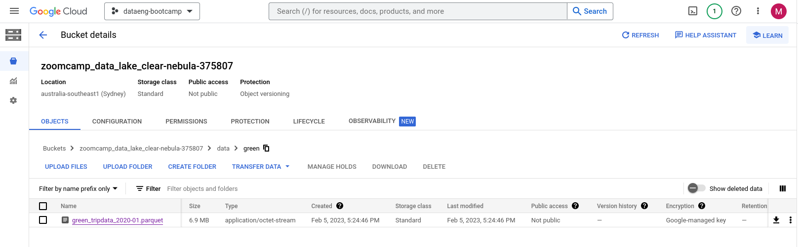

Additionally, we should find a line inside of the logs printed to our terminal that looks something like the following:
```bash
17:24:43.300 | INFO    | Task run 'clean-0' - rows: 447770
```
i.e. **447770 rows** of data was processed by our Prefect flow here.

## Question 2

### Question

[`cron`](https://en.wikipedia.org/wiki/Cron) is a very commonly used *job scheduling* tool (i.e. a piece of software that automatically runs a specified program at a particular time). 

Using the flow you previously created in Question 1, create a Prefect deployment that uses `cron` to automatically execute on the first of every month at 5am UTC. What `cron` schedule should be specified to achieve this behaviour?

### Answer

Simplistically, the syntax that `cron` uses to specify times for scheduled jobs consists of five fields:
```
MIN HR DAY MON WK 
```
Here, `MIN`, `HR`, `DAY`, `MON`, and `WK` denote the minute, hour, day, month, and week day (i.e. Monday to Sunday) the specified job should be performed, respectively. Each of these fields can either be set to: 
- An integer, which indicates that the scheduled job should only be performed for times that match the value of this field. For example, if the `HR` column is `14`, then the scheduled job will only be performed at times when the hour is 2 PM (i.e. `14` o'clock). As another example, if the `WK` field is `5`, the job must be performed on a Friday, since this is the `5`th day of the week.
- A *wildcard operator* (i.e. `*`), which indicates that the scheduled job should be performed for every value of this field. For example, if the `HR` field is a `*`, then the job should be performed every hour, **assuming** that the time also matches all the other fields. 

As a simple example, consider the following `cron` schedule:
```
22 * * * 3
```
This particular `cron` schedule indicates that a job should be run on the `22`nd minute of every hour (i.e. `HR` is `*`), on every day of the month (i.e. `DAY` is `*`), every month (i.e. `MON` is `*`), but only on Wednesdays (i.e. the `3`rd day of the week). 


With all this in mind, the `cron` schedule we should use to run a Prefect flow on the first day of every month at 5 AM is:
```
0 5 1 * *
```
i.e. we should run the job on the `0`th minute of the `5`th hour (i.e. 5 AM) of the `1`st day of every month (i.e. `MON` is `*`), no matter what day of the week it is (i.e. `WK` is `*`).

Now that we know what `cron` schedule to specify, we can create a Prefect deployment that automatically runs the main `etl_web_to_gcs` flow in `etl_to_web_gcs.py` at 5 AM on the first day of every month by calling:
```bash
prefect deployment build \
-n etl_gcs_flow \
--cron "0 5 1 * *" \
--apply flows/etl_web_to_gcs.py:etl_web_to_gcs 
```
Here, we've named our deployment `etl_gcs_flow` and specified our `cron` schedule using the `--cron` flag. 

Just to double-check that we've correctly scheduled this flow, we can inspect the flow we've created in the Prefect Orion CLI. To do this, open another terminal instance and start an Orion UI server by running:
```bash
prefect orion start
```
After opening the link printed to the terminal, you should see a dashboard; click on the 'Deployments' tab on the left-hand side of the screen. You should see the `etl_gcs_flow` deployment we've just defined; importantly, Prefect will note that this deployment is scheduled to run automatically at 5 AM on the first of every month, as expected:

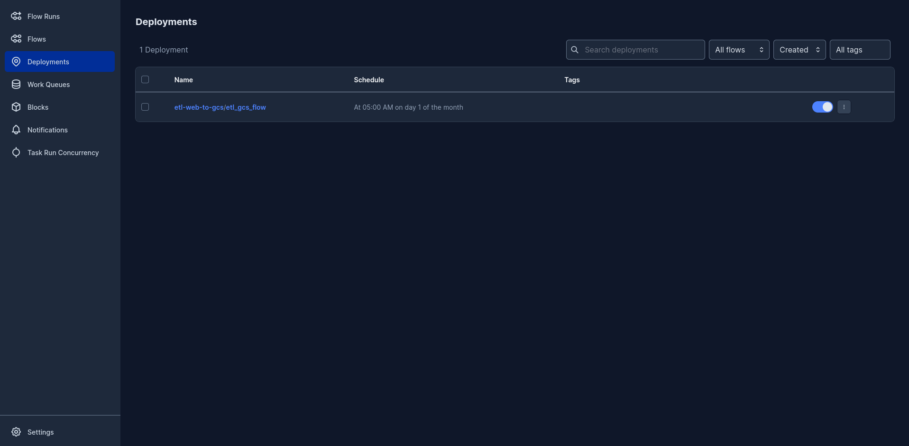

Return to the terminal instance you were previously in, but **keep the terminal instance running the Prefect Orion server open** - we'll be inspecting what's show in the UI in later questions.

## Question 3

### Question

Using [`etl_gcs_to_bq.py` as a template](hhttps://github.com/discdiver/prefect-zoomcamp/blob/main/flows/02_gcp/etl_gcs_to_bq.py), write a Prefect flow that pulls Taxi data Parquet files from a GCS bucket (like the Parquet files we uploaded to our GCS Bucket using the Prefect flow in Question 1), and uploads this data to a BigQuery database. Importantly, this Prefect flow should:
1. **Not** fill or remove rows with missing values. Additionally, the main flow should print the total number of rows processed by the script. 
1. Accept a list of months, a year, and a taxi colour as input parameters, just like the flow your wrote for Question 1.
1. Append data entries to the end of a BigQuery table if that table already exists in the database.

Once this flow is written, create a Prefect deployment that runs on your local machine and that uses the flow code that is locally stored on that same machine.

Run this deployment to pull the yellow taxi parquet data files for February 2019 **and** March 2019 from the GCS Bucket and subsequently upload these files to the BigQuery database. How many rows does your flow code process?

### Answer


A modified version of `etl_gcs_to_bq.py` can be found in the `flows` subdirectory; since the code itself is relatively easy to understand, we won't analyse the code here. We will note, however, that the flow defined in this file utilises the GCP Credentials block we previously created; this is used in conjunction with `pandas-gbq` to write to our deployed BigQuery table.

Before using the flow in `etl_gcs_to_bq.py` to upload the taxi yellow taxi data for February 2019 and March 2019 to our BigQuery database, we first have to use our flow in `etl_web_to_gcs.py` to upload these datasets to our GCS bucket; once in our bucket, we can transfer them over to BigQuery. 

With this in mind, let's first upload the yellow taxi data for February 2019 and March 2019 to our bucket by executing the following command:
```bash
cd flows && \
python3 -m etl_web_to_gcs \
--color='yellow' \
--months=[2,3] \
--year=2019 \
--save_dir='data' \
--bucket_block='gcs-bucket-zoomcamp' && \
cd ..
```
Note that this will take substantially longer than the command we ran in Question 1, since the yellow taxi datasets are substantially larger than the green taxi ones; more specifically, expect this command to take three or so minutes to run.

Once this data is successfully stored in our GCS bucket, let's create a deployment for our `etl_gcs_to_bq` flow:
```bash
prefect deployment build \
-n etl_bq_flow \
--apply flows/etl_gcs_to_bq.py:etl_gcs_to_bq  
```
Upon executing this command, we should see something like the following printed to our terminal:
```bash
Deployment 'etl-gcs-to-bq/etl_bq_flow' successfully created with id '2d47c586-8d66-4dd8-82a6-e54e67d8c4b9'.
```
i.e. we can refer to this deployment using `etl-gcs-to-bq/etl_bq_flow`. This human-readable string that we can use to uniquely identify our deployment is referred to as a [*slug*](https://itnext.io/whats-a-slug-f7e74b6c23e0).

To run our newly-created deployment, we can use `prefect deployment run` and pass in our desired parameters:
```bash
gcp_project_id="clear-nebula-375807" && \
prefect deployment run \
--param color="yellow" \
--param year=2019 \
--param months=[2,3] \
--param bucket_block='gcs-bucket-zoomcamp' \
--param gcs_dir='data' \
--param cred_block='gcp-cred-zoomcamp' \
--param bq_db_name='taxi_data' \
--param bq_table_name='rides' \
--param project_id=$gcp_project_id \
--param save_dir='' \
etl-gcs-to-bq/etl_bq_flow
```
There are two things to note about this command:
1. If running this for yourself, you'll obviously need to set the `gcp_project_id` variable so that it matches the name of our GCP project ID.
1. We've specified that our flow should write to the `rides` table inside of the `taxi_data` BigQuery database; note that `taxi_data` is the name given by Terraform to our deployed BigQuery databsae, whereas `rides` is the name of the table we'd like our flow to create (if it doesn't already exist) or append to (if it already exists).

Executing this command won't begin our flow, however; it merely adds it to the `default` queue of tasks that Prefect should perform. Indeed, after we created the `etl-gcs-to-bq/etl_bq_flow` deployment, Prefect notified us in the terminal that:
```bash
To execute flow runs from this deployment, start an agent that pulls work from the 'default' work queue:
$ prefect agent start -q 'default'
```
Let's follow Prefect's advice and create an agent to execute flow runs from the `default` queue:
```bash
prefect agent start -q 'default'
```
After waiting for a moment, our deployed agent should start executing our job. We can visually monitor the progress of this job by inside of the Orion UI we opened up in the previous question; we should see something like this: 


Once our flow has finished running, we can inspect the logs for this flow run (either through the CLI or the Orion UI); near the very end of the logs, we should see:
```bash
00:26:39.616 | INFO    | Flow run 'dramatic-pig' - Total number of rows processed = 14851920
```
i.e. our flow run processed **14851920 rows** of data. 

We should also double-check that the Prefect flow actually uploaded our data to the `rides` table in our Big Query database; this can be done through the GCP console:
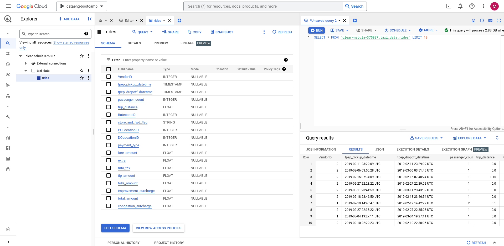

## Question 4

### Question

Create a GitHub storage block and use it to create a Prefect deployment that utilises the `etl_web_to_gcs.py` flow code *hosted on Github*, rather than using the `etl_web_to_gcs.py` flow code that's available on your local machine. 

Run the deployment on your local machine to upload the Green taxi data for November 2020 to your GCS Bucket; how many rows are processed by the flow code?

*Hint*: You will need to push the `etl_web_to_gcs.py` flow code to Github *before* running the deployment.

### Answer

To create a Github storage block that 'points' to the repository of our Data Engineering Zoomcamp repository, we can use the `blocks/github.py` script like so:
```bash
gh_repo_url="https://github.com/mabilton/data-engineering-zoomcamp-2023" && \
cd blocks && \
python3 -m github \
--repo=$gh_repo_url \
--block_name='gh-zoomcamp' && \
cd ..
```
Here, we've specified the name of this block to be `gh-zoomcamp`. Note that if you'd like to create a Github block that points to your own respository, you'll obviously need to alter the `gh_repo_url` variable accordingly. We can check that this block has been successfully created by once again running `prefect blocks ls`:
```
                                                       Blocks                                                       
┏━━━━━━━━━━━━━━━━━━━━━━━━━━━━━━━━━━━━━━┳━━━━━━━━━━━━━━━━━┳━━━━━━━━━━━━━━━━━━━━━┳━━━━━━━━━━━━━━━━━━━━━━━━━━━━━━━━━━━┓
┃ ID                                   ┃ Type            ┃ Name                ┃ Slug                              ┃
┡━━━━━━━━━━━━━━━━━━━━━━━━━━━━━━━━━━━━━━╇━━━━━━━━━━━━━━━━━╇━━━━━━━━━━━━━━━━━━━━━╇━━━━━━━━━━━━━━━━━━━━━━━━━━━━━━━━━━━┩
│ a052e1b4-51ed-4228-9012-86fd312a555e │ GCP Credentials │ gcp-cred-zoomcamp   │ gcp-credentials/gcp-cred-zoomcamp │
│ 276dd893-6da7-4358-b7b2-0fc008aea9f5 │ GCS Bucket      │ gcs-bucket-zoomcamp │ gcs-bucket/gcs-bucket-zoomcamp    │
│ 65e849ac-9be0-4b22-952a-18e1a46c6e50 │ GitHub          │ gh-zoomcamp         │ github/gh-zoomcamp                │
└──────────────────────────────────────┴─────────────────┴─────────────────────┴───────────────────────────────────┘
```
As can be seen, we now have three Prefect blocks available for use.

To create a Prefect deployment that uses the version of the `etl_web_to_gcs` flow stored in the Github repository our `gh-zoomcamp` block is pointing to (as opposed to the `etl_web_to_gcs` that's stored on our local machine), we execute the command:
```
cd ../.. && \
prefect deployment build \
-n github-etl \
-sb github/gh-zoomcamp \
--apply 02-orchestration/homework/flows/etl_web_to_gcs.py:etl_web_to_gcs && \
cd 02-orchestration/homework
```
There are a couple of important points to note about this command:
1. We've used the `-sb` flag (short for 'Storage block') to specify that the `etl_web_to_gcs.py` flow code should be pulled from Github by using the `github` block called `gh-zoomcamp`.
1. As of February 6 2023, Prefect doesn't appear to correctly handle subdirectories when defining deployments that pull code from remote repositories. To make sure everything works, we need to define our deployment inside of the **root directory of our local `git` repository** (hence the `cd ../..` prior to running `prefect deployment build`, as well as the `cd 02-orchestration-homework` after running this command). As a consequence of this, we need to specify the exact subdirectory of the flow script we want to run inside of our Git repository. For my Data Engineering Zoomcamp notes `git` repository (i.e. the one you're looking at right now), this is `02-orchestration/homework/flows/etl_web_to_gcs.py`.
1. Prefect **doesn't push your code to Github**: in order for this flow to work, therefore, it is assumed that the flow code is already pushed to the `main`/`master` branch of your Github repository.

Once this command has successfully run, we should see a message like the following:
```bash
Deployment 'etl-web-to-gcs/github-etl' successfully created with id '498e7c03-3724-45d5-82fb-1ae98cba1e85'.
```
i.e. we can use the slug `etl-web-to-gcs/github-etl` to refect to our newly created deployment. 


At this point, we've now defined our third deployment; we can inspect all of the deployments we've defined thus far by running `prefect deployments ls`:
```
                             Deployments                              
┏━━━━━━━━━━━━━━━━━━━━━━━━━━━━━┳━━━━━━━━━━━━━━━━━━━━━━━━━━━━━━━━━━━━━━┓
┃ Name                        ┃ ID                                   ┃
┡━━━━━━━━━━━━━━━━━━━━━━━━━━━━━╇━━━━━━━━━━━━━━━━━━━━━━━━━━━━━━━━━━━━━━┩
│ etl-gcs-to-bq/etl_bq_flow   │ c0258427-2bd4-4c95-938c-b24a0f16fa32 │
│ etl-web-to-gcs/etl_gcs_flow │ 912efe73-a350-4ae7-91d3-edd744442816 │
│ etl-web-to-gcs/github-etl   │ 38671af3-5233-4cce-8ff8-06386bd2100c │
└─────────────────────────────┴──────────────────────────────────────┘
```

Let's now run our newly-created `etl-web-to-gcs/github-etl` deployment to upload the green taxi November 2020 data by executing:
```bash
prefect deployment run \
--param color="green" \
--param year=2020 \
--param months=11 \
--param save_dir='data' \
--param bucket_block='gcs-bucket-zoomcamp' \
etl-web-to-gcs/github-etl
```
and then by starting up a Prefect agent:
```
prefect agent start -q 'default'
```
Near the start of the logs for this flow, we should see a line that indicates that the flow code to be run has been downloaded from storage:
```
23:26:06.939 | INFO    | Flow run 'soft-coot' - Downloading flow code from storage at ''
```
To make sure this flow is actually running using flow code stored in our Github repository rather than the flow code in our local directory, we can delete `flows/etl_web_to_gcs.py` and re-run the above deployment; we should see that everything still works.

To find out the number of rows processed by our flow, check the logs for a line which looks something like the following:
```
00:38:31.064 | INFO    | Flow run 'mellow-tench' - Total number of rows processed = 88605
```
i.e. our flow processed **88605 rows**.

## Question 5

### Question

Connect to [Prefect Cloud](app.prefect.cloud) and create an Email notification block that automatically sends you an alert email when any flow is successfully completed. While connected to Prefect cloud, run the deployment created in Question 4 to pull the Green taxi data for April 2019 from Github and upload it into your GCS Bucket. How many rows are processed by the flow?

*Hint*: Once you connect your terminal to the Prefect Cloud environment, you'll need to recreate all of the blocks and deployments you created locally during Questions 1 through to 4. This is because the Prefect cloud environment our terminal has connected to is entirely independent from the Prefect environment we've locally been running on our machine (i.e. these Prefect environments don't share any of their blocks, deployments, variables, etc. by default).

### Answer

Before connecting our terminal to Prefect Cloud, we first need to create an account at [app.prefect.cloud](app.prefect.cloud); if you have a Google account, you can just use that instead. Once you've created an account and logged into [app.prefect.cloud](app.prefect.cloud) using a web browser, you'll need to create a new workspace for our terminal to connect to; this is easily done by following the on-screen instructions.

Once this is done, we can connect our terminal to a Prefect Cloud instance by running:
```
prefect cloud login
```
Upon running this, we can authenticate our terminal by logging in to Prefect Cloud with our web browser - just follow the instructions printed to the terminal.

Now that we're logged in, we'll need to recreate all the blocks and deployments we were previously using, since these were all created in our local environment and, therefore, don't exist in the cloud. To confirm that this is, in fact, the case, we can run `prefect blocks ls`, which should print an empty table:
```
          Blocks           
┏━━━━┳━━━━━━┳━━━━━━┳━━━━━━┓
┃ ID ┃ Type ┃ Name ┃ Slug ┃
┡━━━━╇━━━━━━╇━━━━━━╇━━━━━━┩
└────┴──────┴──────┴──────┘
```
as well as `prefect deployments ls`, which will also print an empty table:
```
 Deployments 
┏━━━━━━┳━━━━┓
┃ Name ┃ ID ┃
┡━━━━━━╇━━━━┩
└──────┴────┘
```

To quickly redefine all of the blocks and deployments we'll need to answer Question 5, you can copy and paste the following code to your terimnal (just be sure to change the values of variables to fit your deployment configuration):
```bash
# Define variables (redefine these appropriately if needed):
gcp_creds_path="/home/mabilton/clear-nebula-375807-143b9f4e2461.json" && \
gh_repo_url="https://github.com/mabilton/data-engineering-zoomcamp-2023" && \
bucket_name='zoomcamp_data_lake_clear-nebula-375807' && \
# Create GCP credentials block:
cd blocks && \
python3 -m gcp_cred \
--credentials=$gcp_creds_path \
--block_name='gcp-cred-zoomcamp' && \
cd .. && \
# Create GCS Bucket block:
cd blocks && \
python3 -m gcs_bucket \
--bucket=$bucket_name \
--cred_block='gcp-cred-zoomcamp' \
--block_name='gcs-bucket-zoomcamp' && \
cd .. && \
# Create Github block:
cd blocks && \
python3 -m github \
--repo=$gh_repo_url \
--block_name='gh-zoomcamp' && \
cd .. && \
# Create deployment that pulls `etl_web_to_gcs` from Github repo:
cd ../.. && \
prefect deployment build \
-n github-etl \
-sb github/gh-zoomcamp \
--apply 02-orchestration/homework/flows/etl_web_to_gcs.py:etl_web_to_gcs && \
cd 02-orchestration/homework
```

Now that we've redefined all our blocks and our `github-etl` deployment, we need to set-up an email notification on Prefect Cloud to alert us when this flow has completed. This is done as follows:
1. Click on the 'Blocks' Tab on the left-hand side of the Prefect Cloud UI, and then click the '+' button next to the 'Blocks' page title:
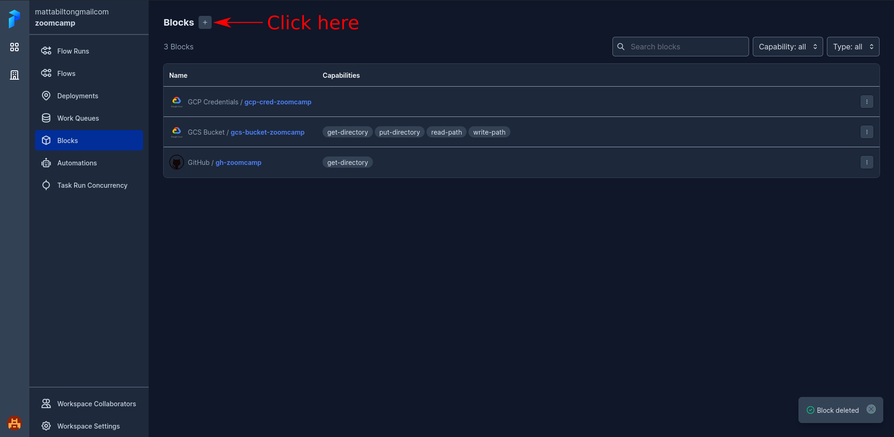
1. Search for the 'Email' block and click 'Add +':
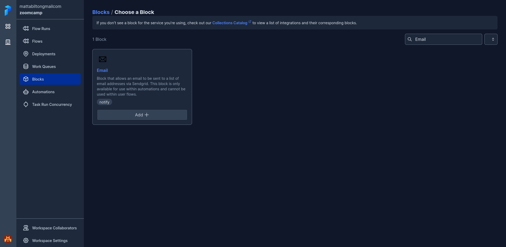
1. Give the block a name and a list of emails to send notifications to, and then click 'Create':
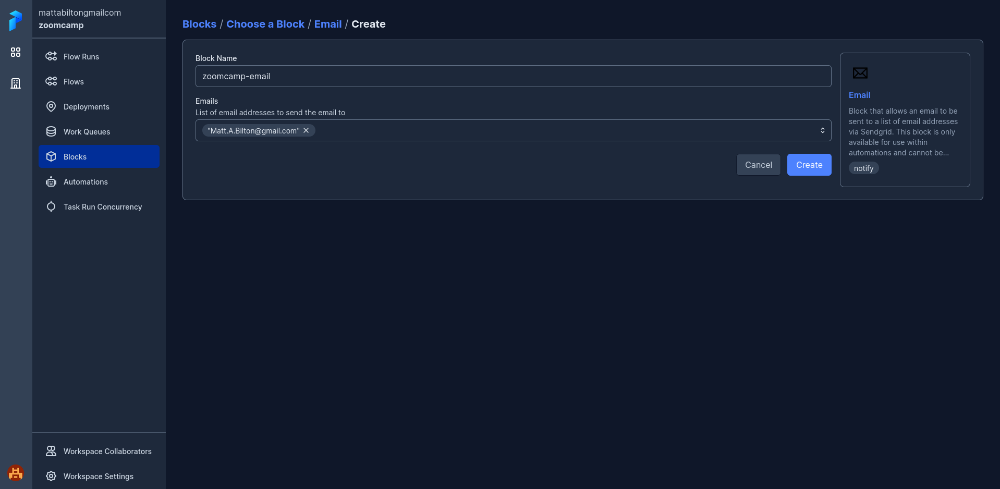
1. Click on the 'Automations' Tab on the left-hand side of the Prefect Cloud UI (just below the 'Blocks' tab), and then click the 'Add Automation +' button:
1. Set the 'Trigger Type' to 'Flow Run State'; this should open up more options. In the last row of options, specify that a notification should be sent when a Flow Run 'Enters' a 'Completed' state. Then click Next:
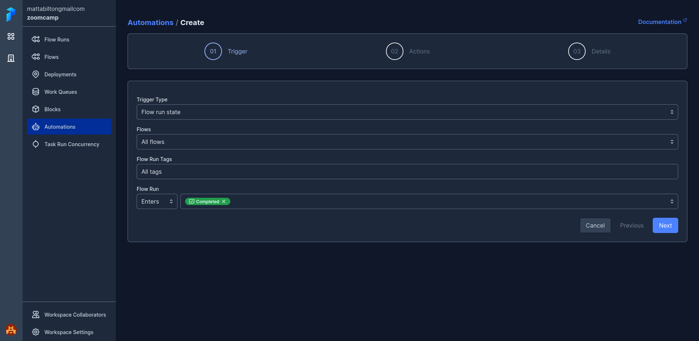
1. Set the 'Action Type' to 'Send a Notification'; this will open up more options. Select the Email block we just created from the 'Block' drop-down menu and click Next:
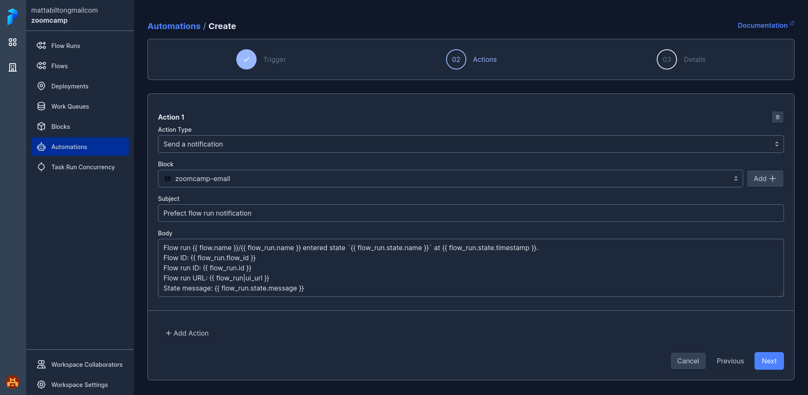
1. Give the automation a name and click Create; automatic emails should now be sent whenever a flow on Prefect Cloud successfully completes:
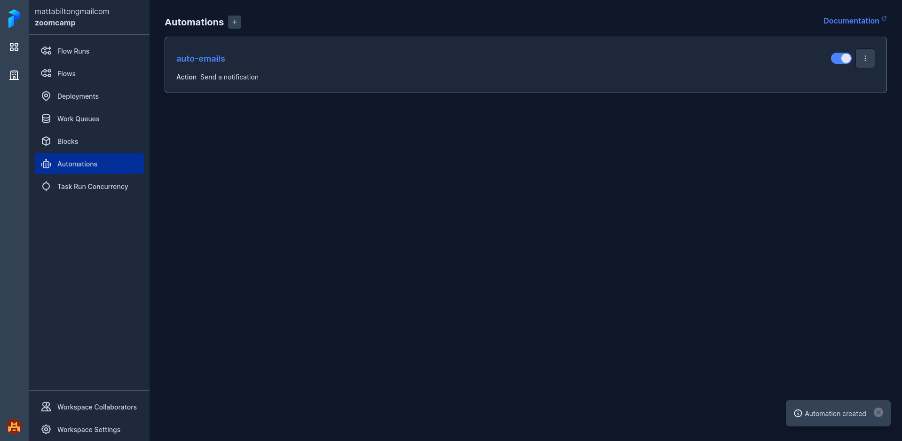


Now that we've set up automatic email notifications, we can now run the `github-etl` deployment we've defined in Prefect Cloud to pull the green taxi data for April 2019; to do this, we execute the following command in our terminal
```bash
prefect deployment run \
--param color="green" \
--param year=2019 \
--param months=4 \
--param save_dir='data' \
--param bucket_block='gcs-bucket-zoomcamp' \
etl-web-to-gcs/github-etl
```
Once again, we'll also need to start an agent in the `default` queue to process the flow run we just submitted:
```bash
prefect agent start -q 'default'
```
We can then inspect the progress of this flow run inside of the Prefect Cloud UI:


After the flow run has successfully completed, we should see that we've automatically been sent an email notifying us of the completion of this flow run:
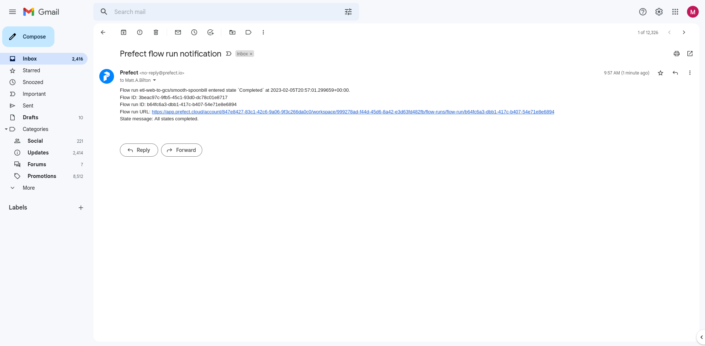

Once our flow has run successfully, we should see within the logs of our agent that:
```bash
09:57:01.144 | INFO    | Flow run 'smooth-spoonbill' - Total number of rows processed = 514392
```
i.e. **514392 rows** were processed by our flow code.

## Question 6

### Question

In Prefect, Secret blocks are used to securely store values that should be kept secret (e.g. access keys). Create a secret block in the UI (either locally or in the cloud) that stores a fake 10-digit password. Once you’ve created your block, check how this 'password' is displayed when the block is clicked on. In particular, how many characters of this 10 character password are shown as asterisks (*)?

### Answer

To create a Secret block in Prefect Cloud, we perform the following steps:
1. Click on the 'Blocks' tab on the left-hand side of the UI, and then click the '+' Button next to the Title of the 'Blocks' page:

1. Search for the 'Secret' block and click 'Add +':
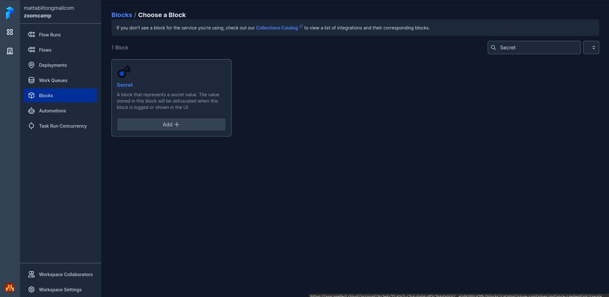
1. Give the block a name and specify the string you'd like the block to securely store. For the purposes of answering this question, we'll store the 10-character string value `0123456789`. Click Create.
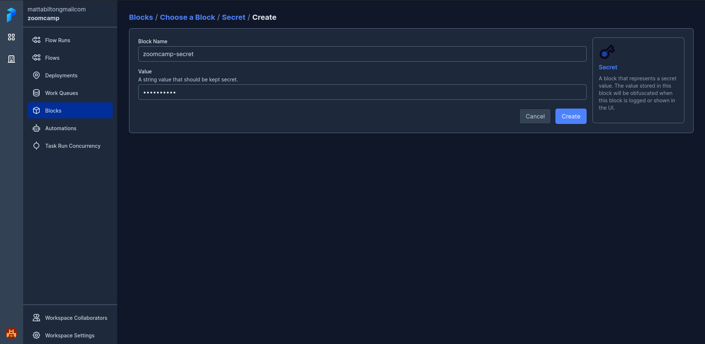
1. We should now see our created Secret block:
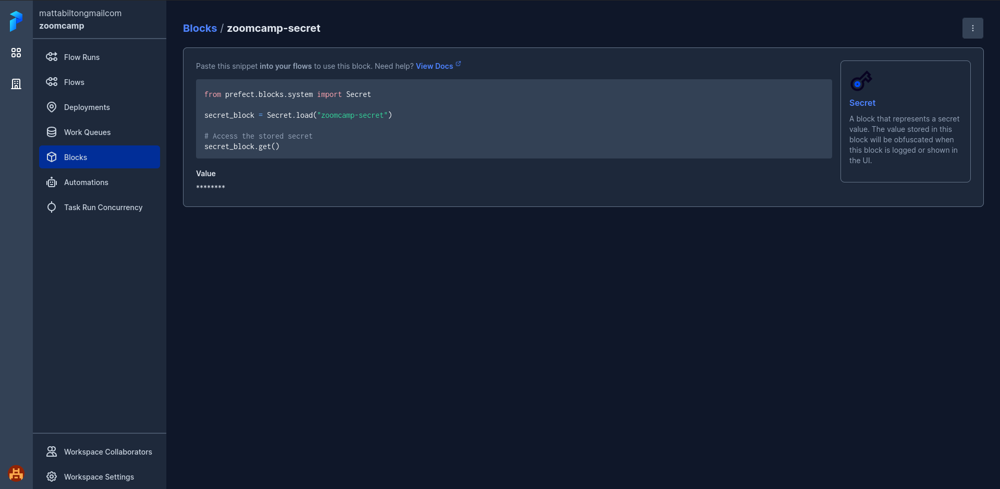

Looking at the last screenshot in the above series of steps, we see that **eight asterisks** are displayed to represent the ten-character string we've stored.

## Cleaning Up

Now that we've answered all of the questions for this week's homework, we should shut-down all the cloud resources we've utilised to prevent being billed for using these resources.

First, we should log out of `prefect cloud`:
```bash
prefect cloud logout
```
After this, we should use Terraform to `destroy` the resources we've deployed to Google Cloud:
```bash
cd terraform && \
terraform destroy && \
cd ..
```
Note that you may recieve an error when attempting the delete the BigQuery database if it's 'In Use'; if this happens, you may have to delete the database manually inside of the GCP Console UI.