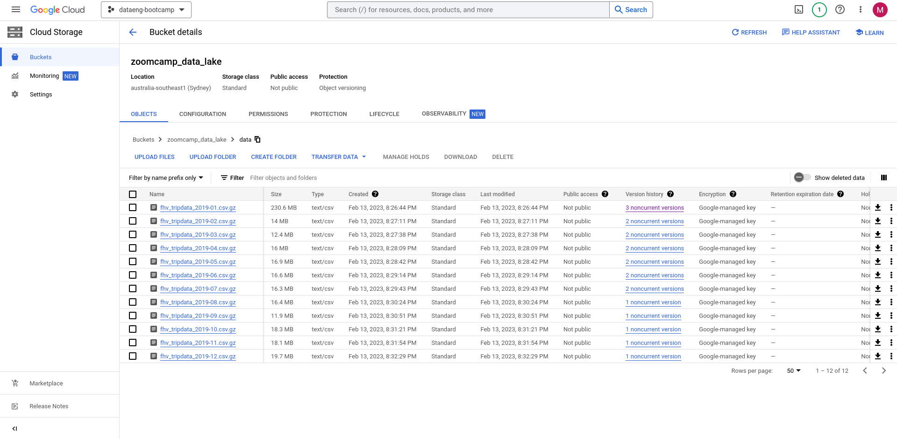

# Week 3 Homework Answers

This file contains my answers to the Week 3 homework questions for the 2023 cohort of the Data Engineering Zoomcamp. For convenience, each question is restated before giving the corresponding answer; the list of questions *without* corresponding answers can be found in `01-questions.md`, which can be found in the current directory.

Please note that all of the intructions provided here **assume that your terminal is located in the `03-warehouse/homework` directory**. Additionally, all of the SQL queries used to answer the homework questions can be found in `queries.sql`.

## Set-Up

### Question 

Before answering any questions, create a data pipeline that pulls all of the F[HV Taxi data for 2019 from Github](https://github.com/DataTalksClub/nyc-tlc-data/releases/tag/fhv), and uploads these compressed CSVs to a GCS bucket. To save space, these CSV files should not be uncompressed.

Once in a Bucket, write *queries in BigQuery* to **create both**:
1. An *external table* using the FHV data in the GCS bucket.
2. An *internal* (AKA 'standard') BigQuery table by using the previously created external table.

### Answer

First, let's deploy the GCS Bucket and BigQuery database we'll need to answer all the homework questions. We can do this using the Terraform files located in the `terraform` folder:
```bash
cd terraform && \
terraform init && \
terraform apply && \
cd ..
```
This creates a GCS Bucket called `zoomcamp_data_lake` and a BigQuery database called `taxi_data`.

Next, we'll use a Prefect data pipeline to upload the compressed FHV CSV data to a GCS Bucket; the code for this pipeline is found within the `prefect` directory. If they don't exist yet, we'll first need to create a GCP Credentials Block and a GCS Bucket Block in Prefect:
```bash
gcp_creds_path="/home/mabilton/clear-nebula-375807-143b9f4e2461.json" && \
cd prefect && \
python3 -m gcp_cred \
--credentials=$gcp_creds_path && \
python3 -m gcs_bucket && \
cd ..
```
Once the Credentials Block and Bucket Block have both been created, we can use the main Prefect flow defined in `etl_web_to_gcs` to upload the FHV data to our GCS Bucket; although we must specify that we want to upload the `2019` FHV data, we **don't** need to specify the name of our Prefect Bucket Block (since the default argument is set to match the default name given by `gcs_bucket.py` to the newly-created GCS Bucket Block):
```bash
cd prefect && \
python3 -m etl_web_to_gcs --year 2019 && \
cd ..
```
After the flow finishes running, we should see the CSV data all uploaded to our GCS Bucket:



With the CSV files now in GCS, we can create an external table in BigQuery called `external_fhv` by entering the following SQL query into the BigQuery console:
```sql
CREATE OR REPLACE EXTERNAL TABLE `clear-nebula-375807.taxi_data.external_fhv`
OPTIONS (
  format = 'CSV',
  uris = ['gs://zoomcamp_data_lake/data/fhv_tripdata_*.csv.gz']
);
```
Note that `clear-nebula-375807` here should be replaced with the name of *your* particular GCP project. We can now create an internal table called `internal_fhv` using this external table by entering the query:
```sql
CREATE OR REPLACE TABLE `clear-nebula-375807.taxi_data.internal_fhv`
AS SELECT * FROM `clear-nebula-375807.taxi_data.external_fhv`;
```

We should now see the `external_fhv` and `internal_fhv` tables in our BigQuery database: 


With these tables in our database, we're now in a position to answer the homework questions.

## Question 1

### Question

How many observations are contained within the FHV dataset for 2019?
- 65,623,481
- 43,244,696
- 22,978,333
- 13,942,414

### Answer

Running the query:
```sql
SELECT COUNT(*) FROM clear-nebula-375807.taxi_data.internal_fhv;
```

returns the following result:


i.e. there are **43244696** rows in the FHV 2019 data.

## Question 2

### Question

Write a query to count the distinct number of `affiliated_base_number` values within the FHV table. 

What is the estimated amount of data that will be read when this query is executed on the External Table and on the Internal/'Standard' Table?
- 25.2 MB for the External Table and 100.87MB for the Internal Table
- 225.82 MB for the External Table and 47.60MB for the Internal Table
- 0 MB for the External Table and 0MB for the Internal Table
- 0 MB for the External Table and 317.94MB for the Internal Table

### Answer

To count the number of distinct `affiliated_base_number` in the internal table, we can execute the query:
```sql
SELECT COUNT(DISTINCT(dispatching_base_num)) FROM `clear-nebula-375807.taxi_data.internal_fhv`;
```
BigQuery estimates that this will cost around **317.94 MB**:


Conversely, to count the number of distinct `affiliated_base_number` in the external table, we can execute the query:

```sql
SELECT COUNT(DISTINCT(dispatching_base_num)) FROM `clear-nebula-375807.taxi_data.external_fhv`;
```
BigQuery estimates that this will cost **0 MB**:


Hence, the answer is: **0 MB for the External Table and 317.94MB for the Internal Table**.

## Question 3

### Question

How many records have both a blank `PUlocationID` and a blank `DOlocationID` across the entire dataset?
- 717,748
- 1,215,687
- 5
- 20,332

### Answer

To count the number of rows with both blank `PUlocationID` and `DOlocationID` values, we can run the query:

```sql
SELECT COUNT(*) FROM `clear-nebula-375807.taxi_data.internal_fhv`
WHERE PUlocationID IS NULL 
AND DOlocationID IS NULL;
```

This returns the result:


i.e. **717748** rows have both blank `PUlocationID` and `DOlocationID` values.

## Question 4

### Question

If our queries always filter by `pickup_datetime` and order on `affiliated_base_number`, what would be the best way to cluster and/or partition the table to improve performance?
- Cluster on `pickup_datetime`, Cluster on `affiliated_base_number`
- Partition by `pickup_datetime`, Cluster on `affiliated_base_number`
- Partition by `pickup_datetime`, Partition by `affiliated_base_number`
- Partition by `affiliated_base_number`, Cluster on `pickup_datetime`

### Answer

For the scenario presented, it is most efficient to **partition by `pickup_datetime`** and **cluster on `affiliated_base_number`**, since:
- Partitioning by `pickup_datetime` allows BigQuery to quickly access the subset of the data corresponding to a particular pickup date
- Clustering each `pickup_datetime` partition by `affiliated_base_number` allows BigQuery to use binary search within each clusted to quickly locate a particular `affiliated_base_number` value within that partition.

## Question 5

### Question

Create the clustered and/or partitioned table you suggested for Question 4, and then write a query that retrieves the distinct `affiliated_base_number` values for taxi rides whose  `pickup_datetime` is between `2019-03-01` and `2019-03-31` (inclusive).

How many bytes does BigQuery estimate will be used when this query is executed on the external table? Similarly, how many bytes does BigQuery estimate will be used when this query is executed on the clustered and/or partitioned table we just created? Pick the answer with the closest match: 
- 12.82 MB for non-partitioned table and 647.87 MB for the partitioned table
- 647.87 MB for non-partitioned table and 23.06 MB for the partitioned table
- 582.63 MB for non-partitioned table and 0 MB for the partitioned table
- 646.25 MB for non-partitioned table and 646.25 MB for the partitioned table

### Answer

We can create a table that is partitioned on `pickup_datetime` and clustered on `affiliated_base_number` by running the query:
```sql
CREATE OR REPLACE TABLE `clear-nebula-375807.taxi_data.optimized_fhv`
PARTITION BY DATE(dropoff_datetime)
CLUSTER BY dispatching_base_num AS (
  SELECT * FROM `clear-nebula-375807.taxi_data.internal_fhv`
);
```
Additionally, we can use the query:
```sql
SELECT DISTINCT(affiliated_base_number) FROM `clear-nebula-375807.taxi_data.optimized_fhv`
WHERE DATE(dropoff_datetime) BETWEEN '2019-03-01' AND '2019-03-31';
```
to retrieve the distinct `affiliated_base_number` values for `dropoff_datetimes` between `2019-03-01` and `2019-03-31` within the partitioned and clustered table. BigQuery estimates that this query will cost approximately **23.06 MB**:


Conversely, we can use the query:
```sql
SELECT DISTINCT(affiliated_base_number) FROM `clear-nebula-375807.taxi_data.internal_fhv`
WHERE DATE(dropoff_datetime) BETWEEN '2019-03-01' AND '2019-03-31';
```
to retrieve the distinct `affiliated_base_number` values for `dropoff_datetimes` between `2019-03-01` and `2019-03-31` within the non-partitioned and non-clustered table. BigQuery estimates that this query will cost approximately **647.87 MB**:


## Question 6

### Question 

Where is the data stored in the External Table you created?
- Big Query
- GCP Bucket
- Container Registry
- Big Table

### Answer

The [BigQuery documentation](https://cloud.google.com/bigquery/docs/external-data-sources) states that:

> External tables are similar to standard BigQuery tables, in that these tables store their metadata and schema in BigQuery storage. However, their data resides in an external source.

For our particular case, this means that although BigQuery is internalling storing the metadata and schema (i.e. column names and column datatypes) of our FHV data, the data itself only exists in the external source, that being the **GCS Bucket** we uploaded the data to.

## Question 7

### Question

"*It is best practice in BigQuery to always cluster your data*" - True or False?

### Answer

It is **not** a best practice to always cluster one's data. This is for a couple of reasons:
1. If the queries you execute don't filter/order by the values of a particular subset of columns, then no computational gains will be achieved by clustering a table using these columns.
2. For smaller datasets, the up-front cost of clustering the data, as well as the ongoing costs of re-clustering the data as more rows are added to the table, may outweight the very marginal speed-ups achieved by clustering the data.

With these points in mind, the decision of whether or not to partition and/or cluster a table should be made on a case-by-case basis.

## Question 8

### Question 

It may be more efficient to store the FHV data as Parquet files instead of as CSVs. With this in mind, create a data pipeline (or extend the one you previously used) that pulls the FHV data from Github, converts it to Parquet, and then uploads it to a GCS Bucket.

Once in the GCS Bucket, create both an external table and an internal table in BigQuery using the Parquet data.  

### Answer

To upload Parquet files instead of CSVs to our GCS Bucket, we just need to specify `--parquet = True` when calling our `etl_web_to_gcs` Prefect data pipeline:
```bash
cd prefect && \
python3 -m etl_web_to_gcs --year=2019 --parquet=True && \
cd ..
```
This should upload the FHV data to our GCS Bucket in Parquet form, alongside our previously-uploaded CSV files:


Next, we can create an external table called `external_fhv_parquet` from these Parquet files by executing in BigQuery:
```sql
CREATE OR REPLACE EXTERNAL TABLE `clear-nebula-375807.taxi_data.external_fhv_parquet`
OPTIONS (
  format = 'PARQUET',
  uris = ['gs://zoomcamp_data_lake/data/fhv_tripdata_*.parquet']
);
```
Finally, an internal table called `internal_fhv_parquet` can be created from `external_fhv_parquet` by running:
```sql
CREATE OR REPLACE TABLE `clear-nebula-375807.taxi_data.internal_fhv_parquet`
AS SELECT * FROM `clear-nebula-375807.taxi_data.external_fhv_parquet`;
```

We should now be able to see both of these tables alongside our BigQuery tables:


## Clean-Up

To ensure that we don't incur any , we can use Terraform to destory all the cloud resources we deployed:
```bash
cd terraform && \
terraform destroy && \
cd .. 
```
And with that done, we've completed all of the homework questions for Week 3 of the course.