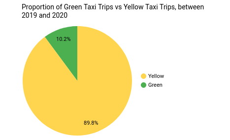
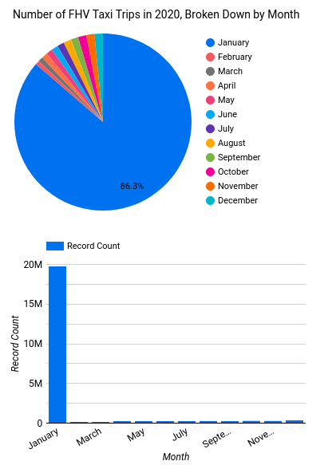

# Week 4 Homework Answers

This file contains my answers to the Week 4 homework questions for the 2023 cohort of the Data Engineering Zoomcamp. For convenience, each question is restated before giving the corresponding answer; the list of questions *without* corresponding answers can be found in `01-questions.md`, which can be found in the current directory.

Please note that all of the intructions provided here **assume that your terminal is located in the `04-analytics/homework` directory**. 

## Set-Up

### Question

Before answering any questions in this week's homework, you first need to upload the following datasets to a GCP Bucket:
1. All of the [Yellow taxi data](https://github.com/DataTalksClub/nyc-tlc-data/releases/tag/yellow) for 2019 and 2020
1. All of the [Green taxi data](https://github.com/DataTalksClub/nyc-tlc-data/releases/tag/green) for 2019 and 2020
1. All of the [FHV taxi data](https://github.com/DataTalksClub/nyc-tlc-data/releases/tag/fhv) for 2019.

Once this data is uploaded, you then need to create a `dbt` project that creates the following tables in a BigQuery database:
1. `stg_green_tripdata`, which stages the Green taxi data uploaded to the GCP Bucket.
1. `stg_yellow_tripdata`, which stages the Yellow taxi data uploaded to the GCP Bucket.
1. `stg_fhv_tripdata`, which stages the FHV taxi data uploaded to the GCP Bucket.
1. `fact_trips`, which stores all of the Yellow and Green taxi data and is formed by transforming the `stg_green_tripdata` and `stg_yellow_tripdata` tables.
1. `fact_fhv_trips`, which stores all of the FHV taxi data and is formed by transforming the `stg_fhv_tripdata` table.
1. `dim_zones`, which stores the [Taxi Zone Lookup table](https://github.com/DataTalksClub/nyc-tlc-data/releases/tag/misc); this table can be stored as a `seed` in the `dbt` project, as opposed to uploading it to a GCP Bucket.

Finally, you should create a Google Data Studio dashboard that can be used to visualise the data in the BigQuery tables created by your `dbt` project.

### Answer

First, let's deploy the GCP resources we need using the Terraform code in the `terraform` directory:

```bash
cd terraform && \
terraform init && \
terraform apply && \
cd ..
```
Next, we need to upload the Green and Yellow Taxi trip datasets for 2019 and 2020, in addition to the FHV Taxi Data for 2020, to a GCS Bucket. After this, we need to create an external table in BigQuery from the files uploaded to our GCS Bucket. We can perform all of these steps in one swoop by executing the Prefect flows in our terminal:
```bash
# Replace `gcp_creds_path` with that path to your GCP credentials JSON:
gcp_creds_path="/home/mabilton/clear-nebula-375807-143b9f4e2461.json" && \
cd prefect && \
# Create credentials block (if it doesn't exist already):
python3 -m gcp_cred --credentials=$gcp_creds_path && \
# Create GCS bucket block:
python3 -m gcs_bucket && \
# Upload upload three sets of taxi data to GCS:
python3 -m etl_web_to_gcs --taxi=fhv --years=2019 && \
python3 -m etl_web_to_gcs --taxi=green --years=[2019,2020] && \
python3 -m etl_web_to_gcs --taxi=yellow --years=[2019,2020] && \
# Create external tables in BigQuery database:
python3 -m etl_gcs_to_bq && \
cd ..
```

Next, we need to use `dbt` to transform the external table data we've uploaded to BigQuery:
```bash
# Redefine these environmental variables appropriately:
export GCP_KEY_PATH=/home/mabilton/clear-nebula-375807-143b9f4e2461.json && \
export GCP_PROJECT_ID="clear-nebula-375807" && \
export BQ_TAXI_TABLE="taxi_data" && \
cd dbt/ny_taxi && \
dbt deps && \
dbt build && \
cd ../..
```

After completing all these steps, we should have the `fact_trips` and `fact_fhv_trips` tables now defined in BigQuery:


## Question 1

### Question

What is the count of records in the model `fact_trips` after running all models and filtering for trips which begin in 2019 and 2020 only?

### Answer

By making the following query in the BigQuery console:
```sql
SELECT COUNT(*) FROM `clear-nebula-375807.taxi_data.fact_trips`
WHERE EXTRACT(YEAR from pickup_datetime) BETWEEN 2019 AND 2020;
```
we see that **61602994** green and yellow taxi trips took place between 2019 and 2020.

## Question 2

### Question

What is the distribution between service type (i.e. Yellow taxi vs Green taxi) fpr the 2019 and 2020 data stored in `fact_trips`? Answer this question using an appropriate visualisation in your Google Data Studio dashboard. 

### Answer

In Google Data Studio, we see that the split between Green and Yellow taxi trips between 2019 and 2020 is roughly **10.2% Green taxi trips, and 89.8% yellow taxi trips**:



## Question 3

### Question

What is the count of records in the model `stg_fhv_tripdata` after running all models?

### Answer

We can count the number of entries in the `stg_fhv_tripdata` view using the query:
```sql
SELECT COUNT(*) FROM `clear-nebula-375807.taxi_data.stg_fhv_tripdata`
```
This returns to us that there are **43244696** rows in this view.

## Question 4

### Question

What is the count of records in the model `fact_fhv_trips` after running all models?

### Answer

Very similarly to Question 3, we execute the following query:
```sql
SELECT COUNT(*) FROM `clear-nebula-375807.taxi_data.fact_fhv_trips`
```
to count the number of rows in the `fact_fhv_trips` table; this query returns **22998722**.

## Question 5

### Question

During which month did the greatest number of FHV taxi trips occur? Answer this question by creating a Google Data Studio visualisation using the `fact_fhv_trips` table.

### Answer

Upon creating a Pie Chart and Bar Chart that shows the breakdown of the number of FHV taxi trips by month, we see that **January**, by far, had the greatest number of FHV trips:



## Clean-Up

As per usual, now that we've finished using the Cloud resources we initially deployed, we should use Terraform to shut-down these resources:
```bash
cd terraform && \
terraform destroy && \
cd ..
```